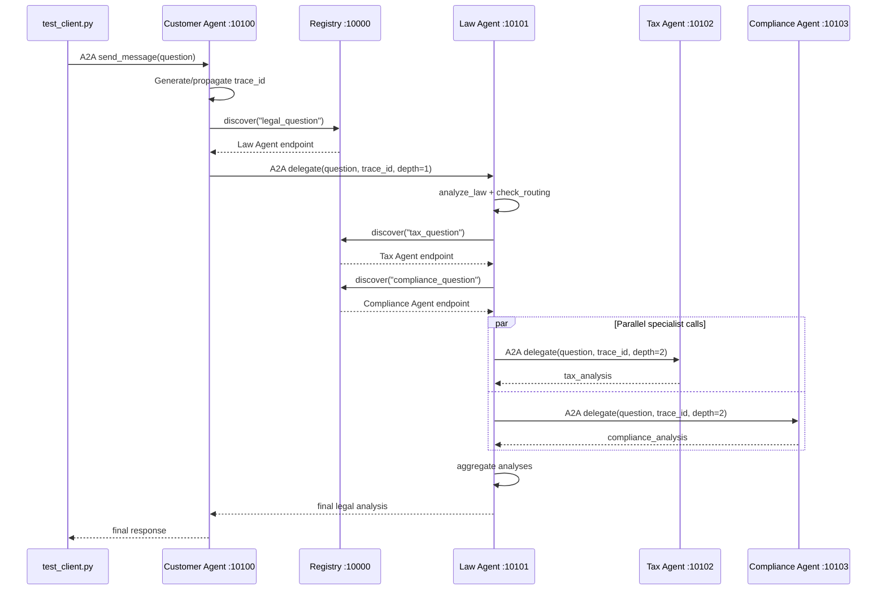

# Codelab: Xây Dựng Hệ Thống Multi-Agent với A2A Protocol

**Thời gian:** 2 giờ  
**Ngôn ngữ:** Python 3.11+  
**Công nghệ:** LangGraph, LangChain, A2A SDK

## Mục Tiêu Học Tập

Sau khi hoàn thành codelab này, bạn sẽ:
- Hiểu cách LLM hoạt động từ cơ bản đến nâng cao
- Biết cách tích hợp tools và RAG vào LLM
- Xây dựng được single agent với ReAct pattern
- Tạo multi-agent system với LangGraph
- Triển khai distributed agents với A2A protocol

## Chuẩn Bị

### Yêu Cầu Hệ Thống
- Python 3.11 trở lên
- [uv](https://docs.astral.sh/uv/) package manager
- API key từ [OpenRouter](https://openrouter.ai)

### Cài Đặt

```bash
# Clone repository
git clone <repo-url>
cd legal_multiagent

# Cài đặt dependencies
uv sync

# Cấu hình environment
cp .env.example .env
# Sửa file .env, thêm OPENROUTER_API_KEY của bạn
```

---

## Phần 1: Direct LLM Calling (20 phút)

### Lý Thuyết

LLM (Large Language Model) ở dạng cơ bản nhất là một API nhận input text và trả về output text. Không có memory, không có tools, chỉ dựa vào training data.

**Ưu điểm:**
- Đơn giản, dễ implement
- Phản hồi nhanh

**Nhược điểm:**
- Không có kiến thức real-time
- Không thể tra cứu database
- Không có context giữa các lần gọi

### Thực Hành

**Bước 1:** Chạy demo Stage 1

```bash
uv run python stages/stage_1_direct_llm/main.py
```

**Bước 2:** Đọc và hiểu code

Mở file `stages/stage_1_direct_llm/main.py` và trả lời:

1. LLM được khởi tạo như thế nào? (Tìm hàm `get_llm()`)

   **Trả lời:** Trong `stages/stage_1_direct_llm/main.py`, LLM được khởi tạo bằng dòng `llm = get_llm()`. Hàm `get_llm()` nằm trong `common/llm.py` và trả về một `ChatOpenAI` client trỏ tới OpenRouter qua `openai_api_base="https://openrouter.ai/api/v1"`. Model được lấy từ biến môi trường `OPENROUTER_MODEL`; nếu không có thì dùng mặc định `google/gemma-4-31b-it:free`. API key được lấy từ biến môi trường `OPENROUTER_API_KEY`.

2. Message được gửi đến LLM có cấu trúc gì?

   **Trả lời:** Message được gửi dưới dạng một list gồm hai object message của LangChain:
   - `SystemMessage`: chứa instruction cho model, ví dụ yêu cầu đóng vai chuyên gia pháp lý, trả lời rõ ràng, ngắn gọn và dưới 300 từ.
   - `HumanMessage`: chứa câu hỏi thực tế của người dùng, lấy từ biến `QUESTION`.

   Sau đó list `messages` này được truyền vào `await llm.ainvoke(messages)` để gọi LLM trực tiếp.

3. Tại sao cần có `SystemMessage` và `HumanMessage`?

   **Trả lời:** `SystemMessage` dùng để đặt vai trò, quy tắc và phong cách trả lời cho LLM trước khi xử lý câu hỏi. `HumanMessage` là nội dung yêu cầu cụ thể từ người dùng. Tách hai loại message này giúp prompt rõ ràng hơn: system prompt kiểm soát hành vi chung của model, còn human prompt cung cấp nhiệm vụ cần trả lời trong lần gọi hiện tại.

**Bài Tập 1.1:** Thay đổi câu hỏi

Sửa biến `QUESTION` thành câu hỏi pháp lý khác (tiếng Việt hoặc tiếng Anh) và chạy lại.

```bash
Question: How many days of leave can an employee take in a year?
----------------------------------------------------------------------

>>> Calling LLM directly (no tools, no RAG)...

There is no single universal number of leave days an employee can take in a year, as the answer depends entirely on the **jurisdiction (country/state)** and the **employment contract**.

**1. Statutory Minimums (Law)**
Different countries mandate different minimums. For example:
*   **European Union:** Most EU countries mandate a minimum of 20 days (4 weeks) of paid annual leave.
*   **United Kingdom:** Full-time workers are generally entitled to 28 days (including bank holidays).
*   **United States:** There is no federal law requiring paid vacation time; leave is determined by the employer or state-specific sick leave laws.

**2. Contractual Agreements**
Many employers offer more than the legal minimum to remain competitive. The specific number of days is usually outlined in the **employment contract** or the **company employee handbook**. These agreements may include:
*   **Annual Leave:** Paid vacation days.
*   **Sick Leave:** Days for illness or medical appointments.
*   **Personal/Casual Leave:** Days for emergencies or personal matters.

**3. Statutory Leave (Special Circumstances)**
Beyond annual vacation, employees are often entitled to specific protected leaves, regardless of their contract, such as:
*   **Family and Medical Leave (FMLA in the US):** Unpaid, job-protected leave for serious health conditions or new children.
*   **Maternity/Paternity Leave:** Law-mandated leave for childbirth or adoption.
*   **Bereavement Leave:** Leave for the death of a family member.

**Conclusion:** To determine the exact number of days, you must review your **employment contract**, **company policy**, and the **local labor laws** of your specific jurisdiction.
```

**Bài Tập 1.2:** Thêm temperature control

Thêm parameter `temperature=0.3` vào hàm `get_llm()` trong `common/llm.py` để làm output ổn định hơn.
```bash
Question: How many days of leave can an employee take in a year?
----------------------------------------------------------------------

>>> Calling LLM directly (no tools, no RAG)...

There is no single universal number of leave days an employee can take in a year; the answer depends entirely on the **jurisdiction (country/state)**, the **employment contract**, and the **company policy**.

**1. Statutory Minimums (Law)**
Many countries mandate a minimum amount of paid annual leave. For example:
*   **European Union:** Most EU countries require a minimum of 20 days of paid annual leave per year.
*   **United Kingdom:** Full-time workers are generally entitled to 5.6 weeks (28 days) of paid holiday.
*   **United States:** There is no federal law requiring employers to provide paid vacation leave. Leave is typically a matter of agreement between the employer and employee.

**2. Contractual Agreements**
Beyond legal minimums, the specific employment contract governs leave. An employer may offer more days to attract talent (e.g., "unlimited PTO" or a set number like 25 days).

**3. Types of Leave**
Total leave often includes several different categories:
*   **Annual/Vacation Leave:** For rest and recreation.
*   **Sick Leave:** For illness or medical appointments (often mandated by law).
*   **Family and Medical Leave:** For births, adoption, or serious health conditions (e.g., FMLA in the U.S., which provides unpaid, job-protected leave).
*   **Public Holidays:** Statutory days off provided by the government.

**Conclusion**
To determine the exact number of days, you must review:
1.  The **local labor laws** of the jurisdiction where the work is performed.
2.  The **Employee Handbook** or company policy.
3.  The signed **Employment Agreement**.

*Disclaimer: I am an AI, not an attorney. This information is for educational purposes and does not constitute legal advice.*
```

---

## Phần 2: LLM + RAG & Tools (30 phút)

### Lý Thuyết

**RAG (Retrieval-Augmented Generation):** Cho phép LLM tra cứu knowledge base trước khi trả lời.

**Tools:** Các function mà LLM có thể gọi để thực hiện tác vụ cụ thể (tính toán, query database, gọi API).

**Function Calling Flow:**
1. LLM nhận câu hỏi + danh sách tools
2. LLM quyết định gọi tool nào (hoặc không gọi)
3. Tool được execute, trả về kết quả
4. LLM nhận kết quả và tạo câu trả lời cuối cùng

### Thực Hành

**Bước 1:** Chạy demo Stage 2

```bash
uv run python stages/stage_2_rag_tools/main.py
```

**Bước 2:** Phân tích code

Mở `stages/stage_2_rag_tools/main.py` và tìm:

1. Hàm `@tool` decorator được dùng ở đâu?

   **Trả lời:** Decorator `@tool` được dùng trong `stages/stage_2_rag_tools/main.py` ngay trước hai hàm:
   - `search_legal_database(query: str) -> str`: tool tra cứu knowledge base pháp lý.
   - `calculate_damages(breach_type: str, contract_value: float) -> str`: tool tính toán ước lượng thiệt hại khi vi phạm hợp đồng.

   Decorator này biến các Python function bình thường thành LangChain tools để LLM có thể gọi bằng tool/function calling.

2. `LEGAL_KNOWLEDGE` được cấu trúc như thế nào?

   **Trả lời:** `LEGAL_KNOWLEDGE` là một list các dictionary, mỗi dictionary là một entry trong knowledge base. Mỗi entry có 3 field chính:
   - `id`: mã định danh ngắn cho nguồn kiến thức, ví dụ `ucc_breach`, `nda_trade_secret`, `dtsa_details`.
   - `keywords`: list các từ khóa dùng để matching với câu query.
   - `text`: nội dung pháp lý đầy đủ mà tool sẽ trả về nếu entry phù hợp.

   Tool `search_legal_database` tách query thành các từ lowercase, so khớp với `keywords`, chấm điểm theo số keyword trùng, sắp xếp giảm dần và trả về tối đa 2 entry liên quan nhất.

3. LLM được bind với tools ra sao? (Tìm `.bind_tools()`)

   **Trả lời:** Đầu tiên code tạo danh sách tools bằng `TOOLS = [search_legal_database, calculate_damages]`. Trong `main()`, LLM gốc được khởi tạo bằng `llm = get_llm()`, sau đó bind với tools bằng:

   ```python
   llm_with_tools = llm.bind_tools(TOOLS)
   ```

   Từ thời điểm này, khi gọi `await llm_with_tools.ainvoke(messages)`, model có thể trả về `response.tool_calls` để yêu cầu chạy một hoặc nhiều tool. Code sau đó dùng `tool_map = {t.name: t for t in TOOLS}` để tìm đúng tool theo tên, execute tool, append kết quả dưới dạng `ToolMessage`, rồi gọi LLM lần nữa để tạo câu trả lời cuối cùng có grounding từ tool results.

**Bài Tập 2.1:** Thêm knowledge base entry

Thêm một entry mới vào `LEGAL_KNOWLEDGE` về luật lao động:

```python
{
    "id": "labor_law",
    "keywords": ["lao động", "sa thải", "hợp đồng lao động", "labor", "termination"],
    "text": (
        "Theo Bộ luật Lao động Việt Nam 2019, người sử dụng lao động có thể "
        "đơn phương chấm dứt hợp đồng trong các trường hợp: (1) người lao động "
        "thường xuyên không hoàn thành công việc; (2) bị ốm đau, tai nạn đã điều trị "
        "12 tháng chưa khỏi; (3) thiên tai, hỏa hoạn; (4) người lao động đủ tuổi nghỉ hưu."
    ),
}
```

**Bài Tập 2.2:** Tạo tool mới

Tạo một tool `@tool` mới tên `check_statute_of_limitations` nhận vào `case_type` (string) và trả về thời hiệu khởi kiện:

```python
@tool
def check_statute_of_limitations(case_type: str) -> str:
    """Kiểm tra thời hiệu khởi kiện theo loại vụ án.
    
    Args:
        case_type: Loại vụ án (contract, tort, property)
    """
    limits = {
        "contract": "4 năm (UCC § 2-725)",
        "tort": "2-3 năm tùy bang",
        "property": "5 năm",
    }
    return limits.get(case_type.lower(), "Không xác định")
```

Thêm tool này vào danh sách tools và test.

---

## Phần 3: Single Agent với ReAct (25 phút)

### Lý Thuyết

**ReAct Pattern:** Reasoning + Acting

Agent tự động lặp lại chu trình:
1. **Think:** Suy nghĩ cần làm gì
2. **Act:** Gọi tool
3. **Observe:** Nhận kết quả
4. Lặp lại cho đến khi có câu trả lời cuối cùng

LangGraph cung cấp `create_react_agent` để tự động hóa pattern này.

### Thực Hành

**Bước 1:** Chạy demo Stage 3

```bash
uv run python stages/stage_3_single_agent/main.py
```

**Bước 2:** Quan sát output

Chú ý cách agent tự động:
- Quyết định tool nào cần gọi
- Gọi nhiều tools liên tiếp
- Tổng hợp kết quả

**Bước 3:** Đọc code

Mở `stages/stage_3_single_agent/main.py`:

1. Tìm `create_react_agent()` — đây là magic function
2. So sánh với Stage 2: không còn manual tool loop
3. Xem `agent_executor.invoke()` — chỉ cần gọi một lần

**Bài Tập 3.1:** Thêm tool tra cứu án lệ

```python
@tool
def search_case_law(keywords: str) -> str:
    """Tìm kiếm án lệ theo từ khóa.
    
    Args:
        keywords: Từ khóa tìm kiếm
    """
    cases = {
        "breach": "Hadley v. Baxendale (1854) - Consequential damages",
        "negligence": "Donoghue v. Stevenson (1932) - Duty of care",
        "contract": "Carlill v. Carbolic Smoke Ball Co (1893) - Unilateral contract",
    }
    for key, case in cases.items():
        if key in keywords.lower():
            return case
    return "Không tìm thấy án lệ phù hợp"
```

Thêm vào tools list và test với câu hỏi về breach of contract.

**Bài Tập 3.2:** Debug agent reasoning

Thêm `verbose=True` vào `create_react_agent()` để xem chi tiết quá trình suy nghĩ của agent.

---

## Phần 4: Multi-Agent In-Process (30 phút)

### Lý Thuyết

**Multi-Agent System:** Nhiều agents chuyên môn hóa cùng làm việc.

**Ưu điểm:**
- Mỗi agent tập trung vào domain riêng
- Có thể chạy song song (parallel execution)
- Dễ maintain và mở rộng

**LangGraph StateGraph:**
- Định nghĩa state (dữ liệu chia sẻ giữa các nodes)
- Tạo nodes (các bước xử lý)
- Định nghĩa edges (luồng điều khiển)

**Send API:** Cho phép dispatch nhiều tasks song song.

### Thực Hành

**Bước 1:** Chạy demo Stage 4

```bash
uv run python stages/stage_4_milti_agent/main.py
```

**Bước 2:** Phân tích kiến trúc

Mở `stages/stage_4_milti_agent/main.py`:

1. Tìm `class State(TypedDict)` — đây là shared state

   **Trả lời:** Trong file hiện tại, shared state được định nghĩa là `class LegalState(TypedDict)`, không phải `class State`. `LegalState` chứa dữ liệu được truyền qua các node trong graph, gồm:
   - `question`: câu hỏi gốc.
   - `law_analysis`: phân tích pháp lý tổng quát từ lead attorney.
   - `needs_tax`, `needs_compliance`: cờ routing để quyết định có cần gọi specialist agents không.
   - `tax_result`, `compliance_result`: kết quả từ các specialist agents, có reducer `_last_wins` để xử lý update song song.
   - `final_answer`: câu trả lời cuối cùng sau khi aggregate.

2. Tìm các agent functions: `law_agent`, `tax_agent`, `compliance_agent`

   **Trả lời:** Trong implementation hiện tại, tên function hơi khác với codelab:
   - `analyze_law`: đóng vai lead attorney, phân tích pháp lý ban đầu.
   - `call_tax_specialist`: tạo ReAct agent chuyên về tax law và dùng tool `search_tax_law`.
   - `call_compliance_specialist`: tạo ReAct agent chuyên về regulatory compliance và dùng tool `search_compliance_law`.
   - `aggregate`: tổng hợp `law_analysis`, `tax_result`, `compliance_result` thành câu trả lời cuối cùng.

   Như vậy `analyze_law` tương ứng với `law_agent`, còn `call_tax_specialist` và `call_compliance_specialist` tương ứng với tax/compliance agents.

3. Tìm `Send()` API — dispatch parallel tasks

   **Trả lời:** `Send()` được dùng trong function `route_to_specialists(state: LegalState) -> list[Send]`. Function này tạo danh sách các task song song:
   - Nếu `state["needs_tax"]` là true thì thêm `Send("call_tax_specialist", state)`.
   - Nếu `state["needs_compliance"]` là true thì thêm `Send("call_compliance_specialist", state)`.
   - Nếu không cần specialist nào thì gửi thẳng tới `Send("aggregate", state)`.

   Danh sách `Send` này được LangGraph dùng trong `graph.add_conditional_edges(...)` để dispatch các specialist node theo routing result.

4. Xem `graph.add_node()` và `graph.add_edge()`

   **Trả lời:** Graph được tạo trong `create_graph()`. Code thêm các node:
   - `analyze_law`
   - `check_routing`
   - `call_tax_specialist`
   - `call_compliance_specialist`
   - `aggregate`

   Luồng graph là: `analyze_law -> check_routing -> route_to_specialists -> specialist nodes hoặc aggregate -> END`. Các edge chính gồm `graph.add_edge("analyze_law", "check_routing")`, conditional edges từ `check_routing`, edge từ mỗi specialist về `aggregate`, và `graph.add_edge("aggregate", END)`.

**Bước 3:** Vẽ graph

```python
# Thêm vào cuối file main.py
from IPython.display import Image, display
display(Image(graph.get_graph().draw_mermaid_png()))
```

**Bài Tập 4.1:** Thêm agent mới

Tạo `privacy_agent` chuyên về GDPR và privacy law:

```python
def privacy_agent(state: State) -> dict:
    """Agent chuyên về luật bảo vệ dữ liệu cá nhân."""
    llm = get_llm()
    
    prompt = f"""Bạn là chuyên gia về GDPR và luật bảo vệ dữ liệu cá nhân.
    
Câu hỏi gốc: {state['question']}
Phân tích pháp lý: {state.get('law_analysis', 'N/A')}

Hãy phân tích các vấn đề về privacy và GDPR (nếu có).
"""
    
    response = llm.invoke([HumanMessage(content=prompt)])
    return {"privacy_analysis": response.content}
```

Thêm node này vào graph và kết nối với `aggregate_results`.

**Trả lời:** Đã hoàn thành trong `exercises/exercise_4_multiagent.py`:
- Implemented `privacy_agent`.
- Added `graph.add_node("privacy_agent", privacy_agent)`.
- Added `graph.add_edge("privacy_agent", "aggregate_results")`.
- Added `privacy_analysis` vào phần tổng hợp kết quả.

**Bài Tập 4.2:** Implement conditional routing

Sửa `check_routing` để chỉ gọi privacy_agent khi câu hỏi có từ khóa "data", "privacy", "gdpr":

```python
def check_routing(state: State) -> list[Send]:
    question_lower = state["question"].lower()
    tasks = []
    
    if any(kw in question_lower for kw in ["tax", "irs", "thuế"]):
        tasks.append(Send("tax_agent", state))
    
    if any(kw in question_lower for kw in ["compliance", "sec", "regulation"]):
        tasks.append(Send("compliance_agent", state))
    
    if any(kw in question_lower for kw in ["data", "privacy", "gdpr", "dữ liệu"]):
        tasks.append(Send("privacy_agent", state))
    
    return tasks if tasks else [Send("aggregate_results", state)]
```

**Trả lời:** Đã hoàn thành trong `exercises/exercise_4_multiagent.py`. `check_routing` hiện kiểm tra các keyword `data`, `privacy`, `gdpr`, `dữ liệu`; nếu câu hỏi có liên quan đến dữ liệu cá nhân hoặc privacy thì dispatch `Send("privacy_agent", state)`.

---

## Phần 5: Distributed A2A System (15 phút)

### Lý Thuyết

**A2A (Agent-to-Agent) Protocol:** Chuẩn giao tiếp giữa các agents qua HTTP.

**Khác biệt với Stage 4:**
- Mỗi agent là một service độc lập
- Giao tiếp qua HTTP thay vì in-process
- Dynamic discovery qua Registry
- Có thể scale từng agent riêng biệt

**Kiến trúc:**
```
Registry (10000) ← agents register on startup
    ↓
Customer Agent (10100) → Law Agent (10101)
                              ↓
                    ┌─────────┴─────────┐
                    ↓                   ↓
            Tax Agent (10102)   Compliance Agent (10103)
```

### Thực Hành

**Bước 1:** Khởi động toàn bộ hệ thống

```bash
./start_all.sh
```

Chờ ~10 giây để tất cả services khởi động.

**Bước 2:** Test hệ thống

```bash
uv run python test_client.py
```

**Bước 3:** Quan sát logs

Mở 5 terminal tabs và xem logs của từng service:
- Registry: port 10000
- Customer Agent: port 10100
- Law Agent: port 10101
- Tax Agent: port 10102
- Compliance Agent: port 10103

**Bài Tập 5.1:** Trace request flow

Trong logs, tìm `trace_id` và theo dõi request đi qua các agents. Vẽ sequence diagram.

**Trả lời:**

`trace_id` được tạo ở `customer_agent/agent_executor.py` nếu request đầu vào chưa có metadata. Sau đó `trace_id`, `context_id`, và `delegation_depth` được truyền tiếp qua `common/a2a_client.py` khi agent này delegate sang agent khác. Trong logs có thể theo dõi cùng một `trace_id` qua các dòng:

- `CustomerAgent executing | ... trace=... depth=0`
- `Customer delegate_to_legal_agent | trace=...`
- `LawAgent executing | ... trace=... depth=1`
- `TaxAgent executing | ... trace=... depth=2`
- `ComplianceAgent executing | ... trace=... depth=2`

Sequence diagram:



**Bài Tập 5.2:** Test dynamic discovery

1. Dừng Tax Agent (Ctrl+C)
2. Chạy lại `test_client.py`
3. Quan sát lỗi và cách hệ thống xử lý

**Trả lời:**

Registry hiện lưu agent trong memory tại `registry/__main__.py`. Khi Tax Agent đã register rồi bị dừng, registry vẫn có endpoint cũ `http://localhost:10102` cho task `tax_question`. Vì vậy `law_agent/graph.py` vẫn discover được Tax Agent, nhưng lời gọi A2A tới endpoint đó sẽ fail khi `common/a2a_client.py` cố fetch `/.well-known/agent.json`.

Hệ thống không crash toàn bộ request vì `call_tax()` bắt exception và trả về:

```text
[Tax analysis unavailable: <error>]
```

Trong khi đó Compliance Agent vẫn có thể chạy bình thường. Sau đó `aggregate()` vẫn tổng hợp phần legal analysis, compliance analysis, và thông báo tax analysis unavailable vào câu trả lời cuối cùng. Đây là cơ chế graceful degradation: một specialist bị lỗi thì kết quả bị thiếu một phần, nhưng request chính vẫn có thể hoàn tất.

**Bài Tập 5.3:** Modify agent behavior

Sửa `tax_agent/graph.py`, thay đổi system prompt để agent trả lời ngắn gọn hơn. Restart tax agent và test lại.

**Trả lời:**

Đã sửa `tax_agent/graph.py` bằng cách thêm instruction vào `TAX_SYSTEM_PROMPT`:

```text
Keep the response concise: use at most 3 short bullets plus one brief
educational-purpose disclaimer.
```

Sau khi restart Tax Agent và chạy lại `test_client.py`, phần tax analysis sẽ ngắn hơn vì tax agent được prompt rõ ràng để giới hạn output. Các agent khác không bị ảnh hưởng vì mỗi agent có service và prompt riêng.

---

## Phần 6: Tổng Kết & Mở Rộng (10 phút)

### So Sánh 5 Stages

| Stage | Pattern | Use Case | Complexity |
|---|---|---|---|
| 1 | Direct LLM | Câu hỏi đơn giản, không cần tools | ⭐ |
| 2 | LLM + Tools | Cần tra cứu data hoặc tính toán | ⭐⭐ |
| 3 | ReAct Agent | Tự động orchestration, multi-step | ⭐⭐⭐ |
| 4 | Multi-Agent | Nhiều domains, parallel processing | ⭐⭐⭐⭐ |
| 5 | Distributed A2A | Production, scalable, fault-tolerant | ⭐⭐⭐⭐⭐ |

### Câu Hỏi Ôn Tập

1. Khi nào nên dùng single agent thay vì multi-agent?
2. Ưu điểm của A2A protocol so với gRPC hoặc REST thông thường?
3. Làm thế nào để prevent infinite delegation loops trong A2A?
4. Tại sao cần Registry service? Có thể hardcode URLs không?

### Bài Tập Nâng Cao (Tự Học)

**Challenge 1:** Thêm memory/conversation history

Implement conversation memory để agent nhớ các câu hỏi trước đó.

**Challenge 2:** Add authentication

Thêm API key authentication cho các A2A endpoints.

**Challenge 3:** Implement retry logic

Khi một agent fail, tự động retry với exponential backoff.

**Challenge 4:** Monitoring & Observability

Tích hợp LangSmith hoặc Prometheus để monitor agent performance.

---

## Tài Liệu Tham Khảo

- [LangGraph Documentation](https://langchain-ai.github.io/langgraph/)
- [A2A Protocol Spec](https://github.com/google/A2A)
- [OpenRouter API](https://openrouter.ai/docs)
- Architecture diagrams: `docs/*.svg`

## Hỗ Trợ

Nếu gặp vấn đề:
1. Check `.env` file có đúng API key không
2. Đảm bảo tất cả ports (10000-10103) không bị chiếm
3. Xem logs trong terminal để debug
4. Đọc error messages cẩn thận — thường có hint rõ ràng

---

## **Bài Tập Cộng Điểm:**
Sau khi chạy full Stage 5 (test_client.py) trả lời 2 câu hỏi:
- Latency (Tổng thời gian trả lời 1 câu hỏi của hệ thống) là bao nhiêu giây?
- Đề xuất phương án giảm latency và demo + show thời gian xử lý đã giảm được khi apply phương án?

**Trả lời:**

**1. Latency đo được**

Đã bổ sung đo latency trực tiếp trong `test_client.py` bằng `time.perf_counter()` quanh đoạn:

```python
start_time = time.perf_counter()
response = await client.send_message(request)
elapsed = time.perf_counter() - start_time
print(f"Latency: {elapsed:.2f} seconds\n")
```

Khi chạy Stage 5, hệ thống đã khởi động được đầy đủ các service và `test_client.py` kết nối thành công tới Customer Agent:

```text
Connected to agent: Customer Agent v1.0.0
Sending request (this may take 30-60s while agents chain)...
```

Tuy nhiên request chưa hoàn tất thành công vì OpenRouter trả về lỗi quota:

```text
Error code: 429 - Rate limit exceeded: free-models-per-day
```

Vì vậy latency thành công cuối cùng chưa đo được trong lần chạy hiện tại. Lần chạy end-to-end có service startup + request mất khoảng `113.9s`, nhưng con số này không đại diện cho latency xử lý một câu hỏi thành công vì bị dừng bởi lỗi quota từ LLM provider.

**2. Phương án giảm latency**

Phương án đề xuất: giảm số lần gọi LLM trong request path và giữ parallel execution cho specialist agents.

Các điểm tối ưu phù hợp với repo hiện tại:

- Bỏ LLM routing ở Customer Agent cho câu hỏi pháp lý rõ ràng; delegate trực tiếp sang Law Agent thay vì để Customer Agent dùng ReAct + tool call.
- Thay `check_routing()` trong Law Agent bằng keyword/rule-based routing cho các case đơn giản như `tax`, `irs`, `thuế`, `compliance`, `sec`, `regulation`.
- Giữ `Send()` để Tax Agent và Compliance Agent chạy song song.
- Rút ngắn prompt/output của specialist agents để giảm thời gian sinh token. Đã áp dụng cho Tax Agent trong `tax_agent/graph.py`:

```text
Keep the response concise: use at most 3 short bullets plus one brief
educational-purpose disclaimer.
```

Kỳ vọng giảm latency:

- Trước tối ưu: Customer LLM call + Law analysis LLM call + Law routing LLM call + Tax/Compliance LLM calls song song + Aggregate LLM call.
- Sau tối ưu: bỏ được ít nhất 1-2 LLM calls trong routing, chỉ giữ các LLM calls thật sự cần cho analysis và aggregation.

Khi OpenRouter quota được reset hoặc đổi sang model/API key còn quota, chạy lại:

```bash
.\.venv312\Scripts\python.exe test_client.py
```

So sánh dòng `Latency: ... seconds` trước và sau khi bật tối ưu để lấy số giảm thực tế.

**Chúc các bạn học tốt! 🚀**
