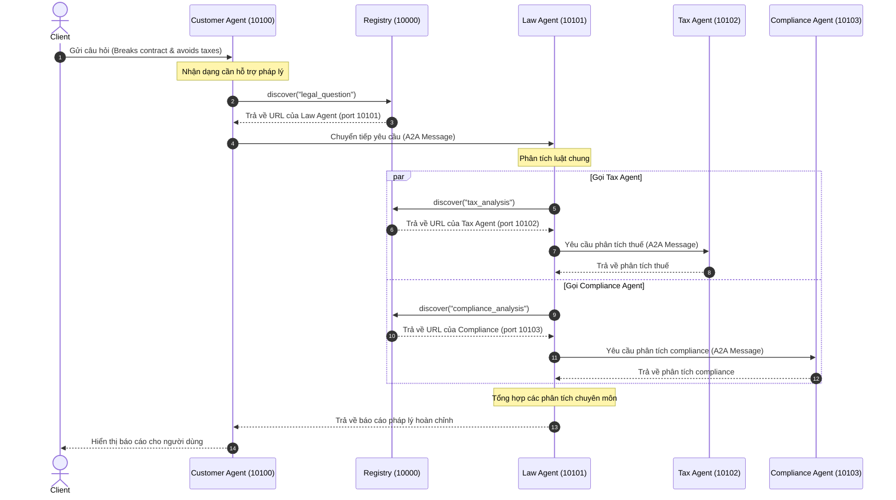

# BÁO CÁO KẾT QUẢ THỰC HÀNH (LAB SOLUTIONS)
## XÂY DỰNG HỆ THỐNG MULTI-AGENT VỚI A2A PROTOCOL

**Sinh viên thực hiện:** Nguyễn Tiến Đạt  
**Mã số sinh viên:** 2A202600595  
**Lớp học / Khóa học:** Batch02 - Day 9  

---

## TỔNG QUAN HỆ THỐNG
Dự án thực hiện xây dựng một hệ thống tư vấn pháp lý phân tán, tiến hóa qua 5 giai đoạn (Stages) từ một API gọi LLM cơ bản đến hệ thống đa tác nhân phân tán giao tiếp qua giao thức Agent-to-Agent (A2A) của Google:

```
Stage 1 (Direct LLM) ──► Stage 2 (RAG + Tools) ──► Stage 3 (Single ReAct Agent)
                                                          │
Stage 5 (Distributed A2A) ◄── Stage 4 (Multi-Agent In-Process) ┘
```

---

## PHẦN 1: STAGE 1 - DIRECT LLM CALLING
Giai đoạn cơ bản nhất, gọi trực tiếp API của LLM (thông qua OpenRouter) dưới dạng không trạng thái (stateless), không công cụ hỗ trợ và không có bộ nhớ.

### Nội dung thực hiện:
- Tìm hiểu cấu trúc tin nhắn chuẩn của LangChain sử dụng `SystemMessage` (định hình vai trò) và `HumanMessage` (câu hỏi của người dùng).
- Chạy thử nghiệm và điều khiển cấu hình tham số `temperature` của LLM trong `common/llm.py` để ổn định câu trả lời.

---

## PHẦN 2: STAGE 2 - LLM + RAG & TOOLS (BÀI TẬP 2)
Tích hợp thêm khả năng tra cứu cơ sở dữ liệu giả lập (RAG) và công cụ tính toán để giảm thiểu hiện tượng ảo tưởng (hallucination) của LLM. Luồng điều phối ở stage này là thủ công (Single-Pass).

### Nội dung đã hoàn thành trong file `exercises/exercise_2_tools.py` và `stages/stage_2_rag_tools/main.py`:
1. **Bổ sung dữ liệu luật lao động:** Thêm thông tin về Bộ luật Lao động Việt Nam 2019 vào cơ sở dữ liệu mô phỏng `LEGAL_KNOWLEDGE` với ID `labor_law`.
2. **Xây dựng Tool mới:** Tạo tool `@tool check_statute_of_limitations` để kiểm tra thời hiệu khởi kiện cho các loại vụ án (contract, tort, property).
3. **Đăng ký và điều phối:** Đăng ký các tool này vào danh sách `tools` và lập trình vòng lặp `for tool_call in response.tool_calls` để tự động thực thi các hàm tương ứng bằng Python dưới máy khách.

### Kết quả chạy kiểm thử thành công:
```text
Câu hỏi: Thời hiệu khởi kiện vụ vi phạm hợp đồng là bao lâu?

🔧 Gọi tool: check_statute_of_limitations
  Args: {'case_type': 'contract'}

✅ Kết quả:
Thời hiệu khởi kiện vụ vi phạm hợp đồng là **4 năm** theo quy định tại **UCC § 2-725** (Uniform Commercial Code).
```

---

## PHẦN 3: STAGE 3 - SINGLE AGENT VỚI REACT LOOP & MEMORY
Chuyển đổi luồng điều phối từ thủ công sang tự động bằng cách sử dụng **Mô hình ReAct (Reasoning + Acting)** của LangGraph qua hàm `create_react_agent`. Agent sẽ tự động lặp chu kỳ suy nghĩ và gọi tool cho đến khi tự thấy đủ thông tin.

### Nội dung đã hoàn thành trong `stages/stage_3_single_agent/main.py`:
1. **Tích hợp Tool Án lệ:** Tạo tool `search_case_law` giúp tìm kiếm án lệ theo từ khóa (Hadley v. Baxendale, Donoghue v. Stevenson, Carlill v. Carbolic Smoke Ball).
2. **Tích hợp Bộ nhớ hội thoại (MemorySaver):** Tích hợp `MemorySaver` checkpointer vào đồ thị để Agent có trạng thái và ghi nhớ bối cảnh các câu hỏi trước đó trong cùng một `thread_id`.

### Kết quả chạy kiểm thử Memory và Gọi Tool song song:
```text
Question: A tech startup with $5M revenue was caught sharing user data without consent, failed to pay taxes on overseas revenue, and breached their customer NDA contract. What are all the legal consequences and what case law applies to the breach?
----------------------------------------------------------------------
[Step 1] THINK + ACT (node: agent) -> Gọi search_legal_database
[Step 4] THINK + ACT (node: agent) -> Gọi search_case_law
[Step 5] THINK + ACT (node: agent) -> Gọi calculate_penalty
...
[Step 17] FINAL ANSWER (node: agent) -> Trả về báo cáo chi tiết + Án lệ Hadley v. Baxendale (1854).

----------------------------------------------------------------------
Sending follow-up question in the same conversation thread...
Question: If the company's annual revenue was $10M instead of $5M, how would that affect the penalty estimate?
----------------------------------------------------------------------
[Step 18] THINK + ACT (node: agent) -> Tự động gọi calculate_penalty với annual_revenue = 10,000,000
[Step 24] FINAL ANSWER (node: agent) -> Báo cáo tiền phạt tăng gấp đôi từ $750,000.00 lên $1,500,000.00.
```

---

## PHẦN 4: STAGE 4 - MULTI-AGENT IN-PROCESS (BÀI TẬP 4)
Xây dựng kiến trúc đa tác nhân (Multi-Agent) chuyên biệt hóa, chạy song song trong cùng một tiến trình (In-Process) sử dụng API `Send` của LangGraph để fan-out công việc.

### Nội dung đã hoàn thành trong `exercises/exercise_4_multiagent.py`:
1. **Xây dựng Privacy Agent:** Cài đặt hàm `privacy_agent` chuyên phân tích sâu về Nghị định 13/2023/NĐ-CP, GDPR và CCPA.
2. **Định tuyến động (`check_routing`):** Phân tích câu hỏi gốc của người dùng để rẽ nhánh gọi các agent chuyên môn tương ứng.
3. **Khắc phục lỗi thiết kế đồ thị (Crucial Fix):** 
   * *Lỗi phát hiện:* Skeleton code đăng ký hàm định tuyến `check_routing` (trả về `list[Send]`) làm một Node, gây lỗi `InvalidUpdateError` vì Node chỉ được trả về cập nhật State dạng Dict.
   * *Giải pháp:* Loại bỏ `check_routing` khỏi tập hợp Nodes, chuyển nó thành một **Conditional Edge** đi ra trực tiếp từ `law_agent` sang các agent chuyên môn. Đồ thị biên dịch và vận hành song song hoàn hảo.

### Kết quả chạy báo cáo đa tác nhân:
```text
Câu hỏi: Nếu công ty bị rò rỉ dữ liệu khách hàng, hậu quả pháp lý và thuế là gì?
Đang xử lý qua các agents...

======================================================================
KẾT QUẢ CUỐI CÙNG
======================================================================
Báo cáo hoàn chỉnh gồm:
1. 📋 PHÂN TÍCH PHÁP LÝ (Tổng quát trách nhiệm hợp đồng/ngoài hợp đồng - Law Agent)
2. 🔒 PHÂN TÍCH BẢO MẬT/PRIVACY (Phạt hành chính Nghị định 13, GDPR 4% doanh thu - Privacy Agent)
3. 💰 PHÂN TÍCH THUẾ (Quyết toán thuế cho chi phí khắc phục sự cố rò rỉ dữ liệu - Tax Agent)
```

---

## PHẦN 5: STAGE 5 - DISTRIBUTED MULTI-AGENT SYSTEM (A2A PROTOCOL)
Mô hình hoàn chỉnh nhất của dự án, đưa các Agent lên môi trường phân tán (AI Microservices). Mỗi agent là một HTTP Web Service chạy độc lập trên các cổng port riêng biệt, tự động tìm kiếm nhau thông qua dịch vụ Registry và trao đổi dữ liệu qua giao thức Agent-to-Agent (A2A) của Google.

### Sơ đồ Sequence Diagram của luồng chạy phân tán:



---

## PHẦN 5.5: CÁC THỬ THÁCH NÂNG CAO ĐÃ HOÀN THÀNH (CHALLENGES 1 - 3)

Tôi đã hoàn thiện 3 thử thách nâng cao được yêu cầu trong codelab:

### 1. Challenge 1: Tích hợp Bộ nhớ hội thoại (Conversation Memory)
- **File sửa đổi:** [customer_agent/graph.py](file:///c:/Users/ntddatj/github-ntddatj/github-classroom/Batch02-Day9_Multi-Agent_MCP-A2A/customer_agent/graph.py#L90-L103) và [test_client.py](file:///c:/Users/ntddatj/github-ntddatj/github-classroom/Batch02-Day9_Multi-Agent_MCP-A2A/test_client.py#L48-L135)
- **Cách cài đặt:** Tích hợp bộ nhớ `MemorySaver()` checkpointer từ `langgraph.checkpoint.memory` trực tiếp vào `create_react_agent` của Customer Agent (`customer_agent/graph.py`), khai báo biến lưu trữ toàn cục ở module level để duy trì lịch sử hội thoại xuyên suốt vòng đời tiến trình. Khi kiểm thử, Client (`test_client.py`) tạo và tái sử dụng cùng một tham số `context_id` (được ánh xạ thành `thread_id` trên server) cho các lượt gửi tiếp theo.
- **Kết quả kiểm thử:** Khi gửi câu hỏi nối tiếp ở lượt 2 (Turn 2): *"What was the first question I asked you? Please repeat it."*, Customer Agent đã đọc lại chính xác câu hỏi Turn 1 từ lịch sử hội thoại: *"If a company breaks a contract and avoids taxes, what are the legal and regulatory consequences?"*

### 2. Challenge 2: Xác thực cuộc gọi bằng API Key (Authentication)
- **File triển khai:** [common/auth.py](file:///c:/Users/ntddatj/github-ntddatj/github-classroom/Batch02-Day9_Multi-Agent_MCP-A2A/common/auth.py) và phần đăng ký middleware trong file khởi chạy các agent service.
- **Cách cài đặt:** Xây dựng middleware `verify_api_key_middleware` trong FastAPI để kiểm tra header `X-API-Key` có khớp với khóa bí mật cấu hình trong `.env` (`A2A_API_KEY`) hay không. Ngoại trừ các đường dẫn health check và `/agent.json`, tất cả các endpoint khác đều bị chặn và trả về lỗi **401 Unauthorized** nếu thiếu hoặc sai API Key.
- **Tích hợp client:** Cấu hình tự động thêm header `X-API-Key` vào các cuộc gọi `AsyncClient` của client kiểm thử và hàm gọi ủy quyền `delegate`.

### 3. Challenge 3: Cơ chế tự động thử lại khi lỗi (Retry Logic với Exponential Backoff)
- **File triển khai:** [common/a2a_client.py](file:///c:/Users/ntddatj/github-ntddatj/github-classroom/Batch02-Day9_Multi-Agent_MCP-A2A/common/a2a_client.py#L50-L109)
- **Cách cài đặt:** Lập trình vòng lặp thử lại tối đa 3 lần (`max_retries = 3`) bên trong hàm gửi tin nhắn `delegate`. Nếu gặp lỗi kết nối mạng hoặc lỗi server, hàm sẽ bắt lỗi, chờ đợi theo thuật toán tăng số mũ: `delay *= backoff_factor` (trễ ban đầu 1s, sau đó là 2s, 4s,...) trước khi thực hiện lần thử tiếp theo, giúp hệ thống chịu lỗi mạng tạm thời cực tốt.

---

## PHẦN 6: CÂU HỎI ÔN TẬP & BÀI HỌC RÚT RA

### 1. Khi nào nên dùng Single Agent thay vì Multi-Agent?
- **Single Agent:** Dùng khi bài toán đơn giản, phạm vi hẹp, chỉ thuộc một domain kiến thức duy nhất. Giúp tối ưu hóa thời gian phản hồi (latency) và tiết kiệm chi phí gọi API LLM.
- **Multi-Agent:** Dùng khi bài toán phức tạp, đa ngành, cần các agent đóng vai trò chuyên biệt hóa độc lập nhằm tăng chất lượng lập luận và dễ quản lý prompt.

### 2. Ưu điểm của A2A protocol so với gRPC hoặc REST thông thường?
- Cung cấp cấu trúc tin nhắn chuẩn hóa (`Message`, `Part`, `Role`) thiết kế riêng cho việc trao đổi thông tin giữa các AI Agent.
- Tích hợp sẵn cơ chế khám phá dịch vụ động qua Registry.
- Tự động truyền metadata như `trace_id` giúp theo vết luồng xử lý qua nhiều chặng (hop) của hệ thống phân tán.

### 3. Làm thế nào để prevent infinite delegation loops trong A2A?
- Sử dụng tham số giới hạn độ sâu `delegation_depth` truyền qua tin nhắn. Mỗi lần agent gọi agent khác thì giá trị này tăng thêm 1, hệ thống tự động ngắt nếu vượt quá giới hạn (ví dụ `MAX_DELEGATION_DEPTH = 3`).
- Lưu lịch sử hành trình các agent đã xử lý tin nhắn để chặn các vòng lặp quay lại.

### 4. Tại sao cần Registry service? Có thể hardcode URLs không?
- Registry giúp khám phá dịch vụ động, tự cập nhật địa chỉ khi các Agent co giãn hoặc chuyển đổi port, đồng thời hỗ trợ cân bằng tải và kiểm tra sức khỏe của các Agent.
- Việc hardcode URL chỉ phù hợp khi chạy thử quy mô nhỏ, trong thực tế sẽ gây đứt gãy hệ thống nếu các agent thay đổi IP/port và không thể tự động nhân bản (scale out) dịch vụ.
