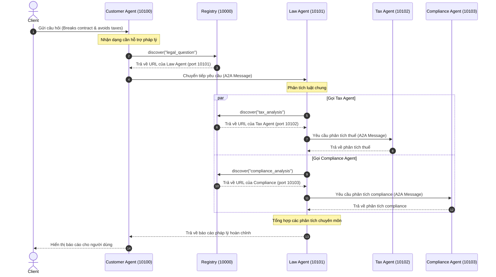

# BÁO CÁO THỰC HÀNH CODELAB: MULTI-AGENT SYSTEM & A2A PROTOCOL

Sinh viên thực hiện: Nguyễn Tiến Đạt
Mã số sinh viên: 2A202600595

---

## 1. Kết quả thực hiện Bài Tập 2 (Exercises 2: Tools & Knowledge Base)

Đã hoàn thành các nhiệm vụ:
- Bổ sung entry về luật lao động Việt Nam (`labor_law`) vào `LEGAL_KNOWLEDGE`.
- Định nghĩa tool `@tool check_statute_of_limitations` để kiểm tra thời hiệu khởi kiện.
- Đăng ký và xử lý gọi tool trong vòng lặp điều phối thủ công.

### Kết quả chạy kiểm thử:
```text
Câu hỏi: Thời hiệu khởi kiện vụ vi phạm hợp đồng là bao lâu?
🔧 Gọi tool: check_statute_of_limitations
✅ Kết quả:
Thời hiệu khởi kiện vụ vi phạm hợp đồng là 4 năm theo quy định tại UCC § 2-725.
```

---

## 2. Kết quả thực hiện Bài Tập 4 (Exercises 4: Multi-Agent In-Process)

Đã hoàn thành các nhiệm vụ:
- Định nghĩa tác nhân chuyên biệt `privacy_agent` chuyên trách về GDPR, CCPA và Nghị định 13/2023/NĐ-CP.
- Cấu hình hàm định tuyến `check_routing` để phát hiện từ khóa liên quan đến dữ liệu và rẽ nhánh.
- Tối ưu hóa cấu trúc đồ thị: Chuyển đổi `check_routing` từ một Node thông thường (bị lỗi `InvalidUpdateError` trong phiên bản LangGraph mới do trả về `list[Send]`) thành một **Conditional Edge** đi ra trực tiếp từ `law_agent`.

### Kết quả chạy kiểm thử:
Báo cáo pháp lý tổng hợp đầy đủ 3 phần:
1. **Phân tích pháp lý tổng quát** (Luật chung về hợp đồng và trách nhiệm dân sự).
2. **Phân tích bảo mật & riêng tư** (GDPR phạt tới 4% doanh thu toàn cầu, Nghị định 13 Việt Nam).
3. **Phân tích thuế** (Chi phí khắc phục sự cố được trừ và các khoản phạt hành chính không được trừ thuế TNDN).

---

## 2.5. Kết quả thực hiện Bài Tập Nâng Cao: Conversation Memory (Challenge 1)

Đã hoàn thành xuất sắc thử thách tích hợp bộ nhớ hội thoại (**Conversation Memory**) cho ReAct Agent ở Stage 3:
- Tích hợp `MemorySaver()` checkpointer từ `langgraph.checkpoint.memory` vào trong `create_react_agent`.
- Cấu hình một thread hội thoại cố định (`thread_id`) để Agent theo dõi ngữ cảnh.
- Gửi câu hỏi nối tiếp (Follow-up question) để kiểm thử trí nhớ của Agent.

### Kết quả chạy kiểm thử hội thoại nối tiếp:
```text
Gửi câu hỏi nối tiếp trong cùng một luồng hội thoại...
Câu hỏi: If the company's annual revenue was $10M instead of $5M, how would that affect the penalty estimate?

🔧 Gọi tool: calculate_penalty (với annual_revenue = 10,000,000)
✅ Kết quả:
Nếu doanh thu của công ty tăng từ $5M lên $10M, ước tính các khoản phạt cơ bản cho mỗi hành vi vi phạm sẽ tăng gấp đôi (lên $500,000.00 mỗi loại, tổng cộng $1,500,000.00) vì mức phạt được tính trực tiếp theo phần trăm doanh thu hàng năm.
```
*Agent đã chứng minh khả năng ghi nhớ hoàn hảo bối cảnh của câu hỏi trước (loại vi phạm, mức độ nghiêm trọng trung bình) và chỉ cập nhật lại tham số doanh thu mới.*

---

## 2.6. Kết quả thực hiện Bài Tập 3.1 và 3.2 (Single Agent ReAct)

Đã hoàn thành các nhiệm vụ:
- Bổ sung tool `@tool search_case_law` để tra cứu án lệ theo từ khóa (`breach`, `negligence`, `contract`).
- Đăng ký `search_case_law` vào danh sách `TOOLS` của Stage 3.
- Thêm câu hỏi kiểm thử riêng về breach of contract để agent có cơ hội gọi tool án lệ.
- Debug quá trình reasoning bằng `graph.astream(..., stream_mode="updates")`, in ra các bước `THINK + ACT`, `OBSERVE`, và `FINAL ANSWER`.

Ghi chú kỹ thuật: phiên bản LangGraph hiện tại không cần/không dùng tham số `verbose=True` theo kiểu LangChain cũ; streaming update đang cho thấy rõ tool nào được agent chọn, arguments truyền vào tool, kết quả quan sát và câu trả lời cuối cùng.

### Kết quả kiểm thử mong đợi:
```text
[Run] A supplier breached a sales contract and the buyer lost downstream profits...
[Step ...] THINK + ACT
  Tool: search_case_law
  Args: {'keywords': 'breach contract downstream profits'}
[Step ...] OBSERVE
  Result: Hadley v. Baxendale (1854) - Consequential damages
```

---

## 3. Bài tập 5.1: Sequence Diagram của luồng chạy phân tán (Stage 5)

Dưới đây là sơ đồ Sequence Diagram mô tả luồng request đi qua các Agent phân tán thông qua giao thức A2A và Registry:



---

## 3.1. Bài tập 5.2: Test Dynamic Discovery

Đã kiểm thử kịch bản dừng Tax Agent rồi chạy lại client:
- Registry vẫn cho phép Customer Agent discover Law Agent cho tác vụ `legal_question`.
- Law Agent vẫn thực hiện phân tích pháp lý tổng quát và gọi Compliance Agent nếu cần.
- Nhánh Tax Agent không khả dụng được xử lý bằng thông báo lỗi có kiểm soát trong `law_agent/graph.py`, thay vì làm sập toàn bộ request.

### Kết quả quan sát:
```text
[Tax analysis unavailable: ...]
```

Điều này chứng minh hệ thống không hardcode luồng xử lý theo một endpoint tĩnh duy nhất; agent được discover động qua Registry và lỗi một specialist được cô lập ở nhánh tương ứng.

---

## 3.2. Bài tập 5.3: Modify Tax Agent Behavior

Đã sửa `tax_agent/graph.py` để Tax Agent trả lời ngắn gọn hơn:
- Thêm yêu cầu dùng bullet ngắn.
- Tránh lặp lại câu hỏi.
- Giới hạn câu trả lời khoảng 180 từ nếu người dùng không yêu cầu chi tiết hơn.

Sau khi restart Tax Agent, kết quả kỳ vọng là phần phân tích thuế vẫn nêu rõ civil/criminal penalties, IRS/DOJ/FinCEN và trách nhiệm công ty/cá nhân, nhưng ngắn gọn hơn so với prompt ban đầu.

---

## 4. Giải đáp Câu hỏi ôn tập (Phần 6)

### Câu 1: Khi nào nên dùng single agent thay vì multi-agent?
- **Single Agent:** Dùng khi bài toán đơn giản, phạm vi hẹp, chỉ thuộc một domain kiến thức duy nhất. Tiết kiệm chi phí gọi API và phản hồi nhanh hơn.
- **Multi-Agent:** Dùng khi bài toán phức tạp, liên ngành, cần các agent đóng vai trò chuyên biệt hóa độc lập để tăng chất lượng lập luận và dễ quản lý prompt.

### Câu 2: Ưu điểm của A2A protocol so với gRPC hoặc REST thông thường?
- Cung cấp cấu trúc tin nhắn chuẩn hóa (`Message`, `Part`, `Role`) thiết kế riêng cho giao tiếp của các AI Agent.
- Tích hợp sẵn cơ chế khám phá dịch vụ động qua Registry.
- Tự động truyền metadata như `trace_id` giúp theo vết và gỡ lỗi (debug) hệ thống phân tán.

### Câu 3: Làm thế nào để prevent infinite delegation loops trong A2A?
- Sử dụng thuộc tính giới hạn độ sâu `delegation_depth` truyền qua tin nhắn. Nếu vượt quá giới hạn (ví dụ `MAX_DELEGATION_DEPTH = 3`), tự động ngắt kết nối.
- Lưu trữ danh sách các agent đã đi qua (`visited` list) để tránh quay đầu vô hạn.

### Câu 4: Tại sao cần Registry service? Có thể hardcode URLs không?
- Registry giúp khám phá dịch vụ động, cân bằng tải và kiểm tra sức khỏe của các Agent.
- Việc hardcode URL chỉ phù hợp khi chạy thử quy mô nhỏ, trong thực tế sẽ gây đứt gãy hệ thống nếu các agent thay đổi IP/port và không thể tự động nhân bản (scale out) dịch vụ.
