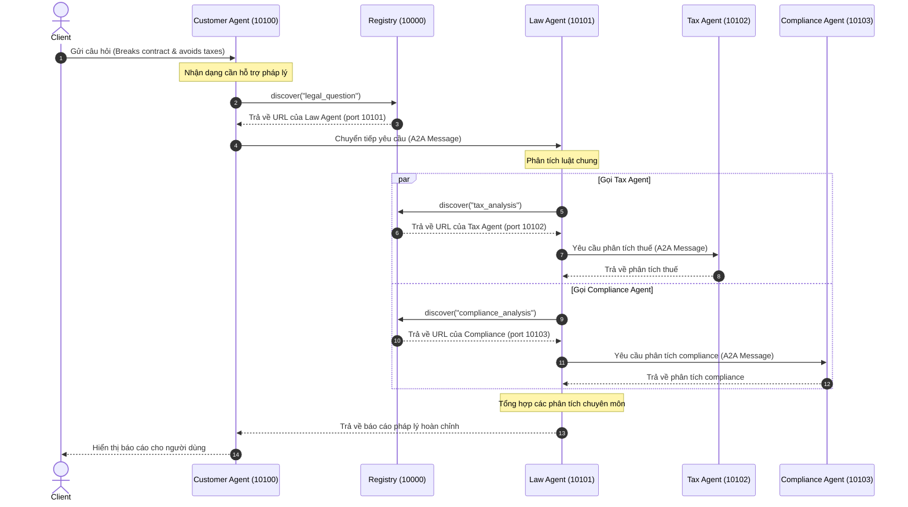

# BÁO CÁO THỰC HÀNH CODELAB: MULTI-AGENT SYSTEM & A2A PROTOCOL

Sinh viên thực hiện: Nguyễn Tiến Đạt
Mã số sinh viên: 2A202600595

---

## 1. Kết quả thực hiện Bài Tập 2 (Exercises 2: Tools & Knowledge Base)

Đã hoàn thành các nhiệm vụ:
- Bổ sung entry về luật lao động Việt Nam (`labor_law`) vào `LEGAL_KNOWLEDGE`.
- Định nghĩa tool `@tool check_statute_of_limitations` để kiểm tra thời hiệu khởi kiện.
- Đăng ký và xử lý gọi tool trong vòng lặp điều phối thủ công.

### Kết quả chạy kiểm thử:
```text
Câu hỏi: Thời hiệu khởi kiện vụ vi phạm hợp đồng là bao lâu?
🔧 Gọi tool: check_statute_of_limitations
✅ Kết quả:
Thời hiệu khởi kiện vụ vi phạm hợp đồng là 4 năm theo quy định tại UCC § 2-725.
```

---

## 2. Kết quả thực hiện Bài Tập 4 (Exercises 4: Multi-Agent In-Process)

Đã hoàn thành các nhiệm vụ:
- Định nghĩa tác nhân chuyên biệt `privacy_agent` chuyên trách về GDPR, CCPA và Nghị định 13/2023/NĐ-CP.
- Cấu hình hàm định tuyến `check_routing` để phát hiện từ khóa liên quan đến dữ liệu và rẽ nhánh.
- Tối ưu hóa cấu trúc đồ thị: Chuyển đổi `check_routing` từ một Node thông thường (bị lỗi `InvalidUpdateError` trong phiên bản LangGraph mới do trả về `list[Send]`) thành một **Conditional Edge** đi ra trực tiếp từ `law_agent`.

### Kết quả chạy kiểm thử:
Báo cáo pháp lý tổng hợp đầy đủ 3 phần:
1. **Phân tích pháp lý tổng quát** (Luật chung về hợp đồng và trách nhiệm dân sự).
2. **Phân tích bảo mật & riêng tư** (GDPR phạt tới 4% doanh thu toàn cầu, Nghị định 13 Việt Nam).
3. **Phân tích thuế** (Chi phí khắc phục sự cố được trừ và các khoản phạt hành chính không được trừ thuế TNDN).

---

## 3. Bài tập 5.1: Sequence Diagram của luồng chạy phân tán (Stage 5)

Dưới đây là sơ đồ Sequence Diagram mô tả luồng request đi qua các Agent phân tán thông qua giao thức A2A và Registry:



---

## 4. Giải đáp Câu hỏi ôn tập (Phần 6)

### Câu 1: Khi nào nên dùng single agent thay vì multi-agent?
- **Single Agent:** Dùng khi bài toán đơn giản, phạm vi hẹp, chỉ thuộc một domain kiến thức duy nhất. Tiết kiệm chi phí gọi API và phản hồi nhanh hơn.
- **Multi-Agent:** Dùng khi bài toán phức tạp, liên ngành, cần các agent đóng vai trò chuyên biệt hóa độc lập để tăng chất lượng lập luận và dễ quản lý prompt.

### Câu 2: Ưu điểm của A2A protocol so với gRPC hoặc REST thông thường?
- Cung cấp cấu trúc tin nhắn chuẩn hóa (`Message`, `Part`, `Role`) thiết kế riêng cho giao tiếp của các AI Agent.
- Tích hợp sẵn cơ chế khám phá dịch vụ động qua Registry.
- Tự động truyền metadata như `trace_id` giúp theo vết và gỡ lỗi (debug) hệ thống phân tán.

### Câu 3: Làm thế nào để prevent infinite delegation loops trong A2A?
- Sử dụng thuộc tính giới hạn độ sâu `delegation_depth` truyền qua tin nhắn. Nếu vượt quá giới hạn (ví dụ `MAX_DELEGATION_DEPTH = 3`), tự động ngắt kết nối.
- Lưu trữ danh sách các agent đã đi qua (`visited` list) để tránh quay đầu vô hạn.

### Câu 4: Tại sao cần Registry service? Có thể hardcode URLs không?
- Registry giúp khám phá dịch vụ động, cân bằng tải và kiểm tra sức khỏe của các Agent.
- Việc hardcode URL chỉ phù hợp khi chạy thử quy mô nhỏ, trong thực tế sẽ gây đứt gãy hệ thống nếu các agent thay đổi IP/port và không thể tự động nhân bản (scale out) dịch vụ.
