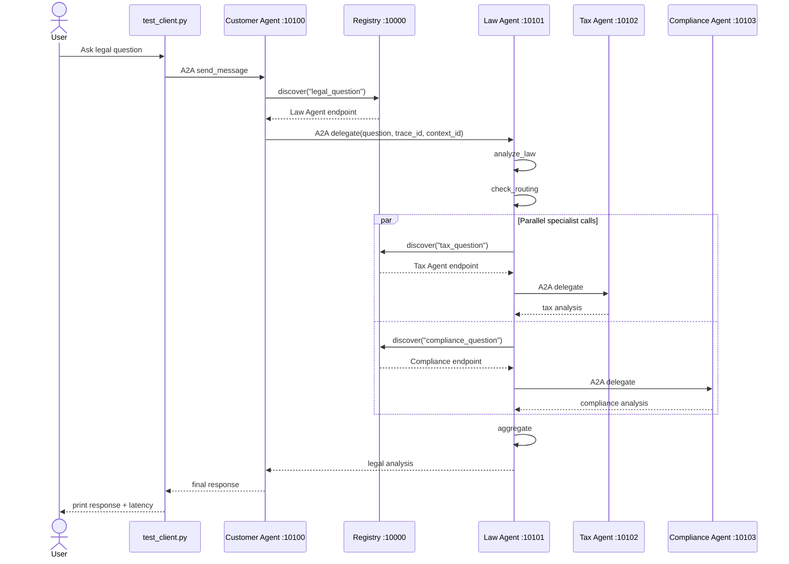

# Extra Credit Report - A2A Multi-Agent System

## Scope

This report covers the optional / extra-credit work from `CODELAB.md`:

- Trace request flow and sequence diagram
- Dynamic discovery test by stopping Tax Agent
- Latency measurement and latency-reduction proposal
- Optional extensions: retry logic, auth, monitoring, memory, and Financial Agent
- MCP external capability used by one worker agent

## Request Flow Trace



Trace IDs are propagated in A2A message metadata:

- `trace_id`
- `context_id`
- `delegation_depth`

Relevant logs:

- Customer Agent: `CustomerAgent executing | task=... context=... trace=... depth=...`
- Law Agent: `LawAgent executing | task=... context=... trace=... depth=...`
- Law Agent: `Routing decision: needs_tax=... needs_compliance=...`
- Law Agent: `Tax Agent returned ... chars`
- Law Agent: `Compliance Agent returned ... chars`

## Dynamic Discovery Test

Procedure:

1. Start Registry, Tax Agent, Compliance Agent, Law Agent, and Customer Agent.
2. Run `uv run python test_client.py`.
3. Stop Tax Agent.
4. Run `uv run python test_client.py` again.

Expected behavior:

- The Registry may still hold a stale Tax Agent registration because it is an in-memory registry without health-based eviction.
- Law Agent still discovers the Tax Agent endpoint.
- A2A delegation to Tax Agent fails after retries.
- `law_agent.graph.call_tax()` catches the failure and returns a fallback section:

```text
[Tax analysis unavailable: ...]
```

The final response can still be produced from legal and compliance analysis.

## Latency Measurement

`test_client.py` now prints end-to-end latency:

```text
Latency: <seconds> seconds
```

Measurements should be taken with the same question, model, and token settings.

| Run | Settings | Result |
|---|---|---|
| Baseline | Default LLM routing, `OPENROUTER_MODEL=openrouter/owl-alpha`, `OPENROUTER_MAX_TOKENS=200` | `143.64s` |
| Optimized | `USE_HEURISTIC_ROUTING=1`, concise Tax prompt, `OPENROUTER_MODEL=openrouter/owl-alpha`, `OPENROUTER_MAX_TOKENS=200` | `128.76s` |
| Tax Agent stopped | Optimized settings, Tax Agent port `10102` stopped | `123.97s`, final response still returned |

Latency reduction:

```text
143.64s - 128.76s = 14.88s saved
14.88 / 143.64 = 10.36% faster
```

## Latency Reduction Proposal

The main latency drivers are:

1. Multiple LLM calls: Customer routing, Law analysis, Law routing, Tax, Compliance, aggregation.
2. Specialist calls are parallel, but Law analysis and aggregation are sequential.
3. Long output tokens increase completion time.
4. Registry discovery and A2A HTTP hops add small overhead.

Implemented improvements:

- `OPENROUTER_MAX_TOKENS` default is capped at `200`.
- Tax Agent prompt now asks for concise answers.
- A2A and Registry clients now retry transient failures with exponential backoff.
- Optional `USE_HEURISTIC_ROUTING=1` skips the Law Agent routing LLM call and uses keyword routing.

Dynamic-discovery test evidence from Law Agent logs:

```text
Heuristic routing decision: needs_tax=True needs_compliance=True
Delegation to http://localhost:10102 failed on attempt 1/3: All connection attempts failed
Delegation to http://localhost:10102 failed on attempt 2/3: All connection attempts failed
call_tax failed: All connection attempts failed
Compliance Agent returned 3848 chars
```

Monitoring evidence:

```text
a2a_requests_total{service="registry",method="GET",route="/discover/tax_question",status="200"} 2
a2a_requests_total{service="law_agent",method="POST",route="/",status="200"} 2
a2a_request_latency_seconds_sum{service="customer_agent",method="POST",route="/"} 252.727807
```

Further options:

- Cache registry discovery results per process.
- Cache Agent Cards per endpoint.
- Stream partial responses.
- Use a smaller model for routing and aggregation.
- Add health checks / TTL eviction in Registry to avoid retrying dead agents.

## Optional Extensions Implemented

### Retry Logic

Added retries for:

- Registry `register()` and `discover()`
- A2A delegation to downstream agents

Environment variables:

```bash
A2A_RETRY_ATTEMPTS=3
REGISTRY_RETRY_ATTEMPTS=3
```

### API-Key Authentication

Optional shared API key authentication is available with:

```bash
AGENT_API_KEY=shared_secret
```

When configured, Registry and A2A services require:

```text
X-Agent-API-Key: shared_secret
```

Internal clients automatically attach the header.

Auth middleware smoke test:

```text
no_header 401
with_header 200
```

### Monitoring

Every service exposes lightweight metrics:

```text
/metrics
```

Metrics include request counts and latency sums in Prometheus-style text format.

### Conversation Memory

Customer Agent stores short in-memory conversation history per `context_id`.

This lets follow-up questions in the same A2A context include prior user/assistant turns.

### Financial Agent

The in-process multi-agent exercises now include a Financial Agent for:

- direct damages
- remediation costs
- penalties
- lost revenue
- business interruption
- insurance / deductible exposure
- compliance upgrade costs

### MCP External Capability

Tax Agent now uses an external MCP-style tax law tool server:

```text
Tax Agent worker
    -> search_tax_code_mcp LangChain tool
    -> common.mcp_client stdio JSON-RPC client
    -> mcp_tools.tax_law_server external process
    -> tools/call search_tax_code
    -> statute / penalty references
```

This satisfies the lab requirement:

```text
Chọn 1 worker dùng external capability qua MCP
```

The external server supports MCP-like JSON-RPC methods:

- `initialize`
- `tools/list`
- `tools/call`

Smoke test command:

```bash
uv run python -c "import asyncio; from common.mcp_client import call_tax_code_mcp; print(asyncio.run(call_tax_code_mcp('FBAR FATCA penalty')))"
```
